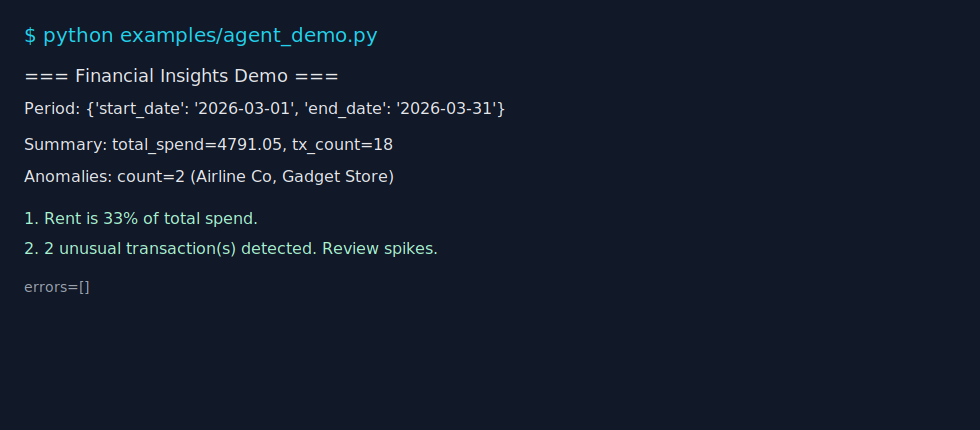

# Financial Data MCP Server


Plug financial data (FX, crypto, transactions, stock quotes) into AI agents via MCP tools.

## Why this MCP server?

AI agents often cannot directly access finance-specific APIs or normalize financial data formats safely.
This project provides plug-and-play MCP tools so agents can fetch prices, analyze spending, and generate actionable financial signals with one consistent interface.

## Use Cases

- AI financial assistant for monthly check-ins
- Budget analyzer with category-level spend insights
- Crypto tracker for live market prices
- Personal spending anomaly detector

## Tools

1. `convert_currency`
2. `get_crypto_price`
3. `list_transactions`
4. `get_spending_summary`
5. `flag_anomalies`
6. `financial_insights` (composite)
7. `get_stock_quote`
8. `ingest_financial_documents` (privacy-first PDF ingestion)

## Tech Stack

- Python
- MCP Python SDK
- FastAPI (health endpoint)
- Public APIs:
  - ExchangeRate API: `https://open.er-api.com/v6/latest/{BASE}`
  - CoinGecko Simple Price: `https://api.coingecko.com/api/v3/simple/price`
  - Alpha Vantage Global Quote: `https://www.alphavantage.co/query`

## Project Layout

- `app/main.py` - MCP tool registration and app bootstrap
- `app/tools/currency.py` - FX conversion with cache/logging
- `app/tools/crypto.py` - crypto quote lookup with cache/logging
- `app/tools/transactions.py` - seeded transaction analysis
- `app/tools/insights.py` - composite spending + anomaly insights
- `app/tools/stock.py` - stock quote integration
- `app/tools/ingestion.py` - PDF parser + transaction sanitizer
- `examples/agent_demo.py` - demo agent-like workflow
- `tests/` - baseline and composite tests

## Quickstart (1-min setup)

```bash
python -m venv .venv
source .venv/bin/activate
pip install -e ".[test]"
make test
```

## Run

### Start MCP server (stdio transport)

```bash
make run
```

### Start FastAPI dev server

```bash
make dev
```

Health check:

```bash
curl http://127.0.0.1:8000/health
```

## Example Agent Demo

```bash
python examples/agent_demo.py
```

## Ingestion-first Flow

Transaction analytics tools now require a prior ingestion step in the current server session.

1. Call `ingest_financial_documents` with one or more PDF statement paths.
2. Use `list_transactions`, `get_spending_summary`, `flag_anomalies`, or `financial_insights`.

If ingestion has not been run, these tools return:

```json
{
  "ok": false,
  "error": "No ingested transactions available. Run ingest_financial_documents first.",
  "source": "ingestion",
  "type": "ingestion_required"
}
```

## Example Output

```text
=== Financial Insights Demo ===
Period: {'start_date': '2026-03-01', 'end_date': '2026-03-31'}

Summary:
{'currency': 'USD',
 'period': {'end_date': '2026-03-31', 'start_date': '2026-03-01'},
 'total_spend': 4791.05,
 'totals_by_category': {'education': 179.0, 'entertainment': 17.0, 'food': 266.12, ...},
 'transaction_count': 18}

Anomalies:
{'anomalies': [...], 'baseline': {'mad': 41.7, 'median': 57.65}, 'count': 3}

Insights:
1. 3 unusual transaction(s) detected. Review spikes for one-off or avoidable spend.
```



## Tool I/O Examples

### `financial_insights` (composite)

Request args:

```json
{"start_date":"2026-03-01","end_date":"2026-03-31","min_amount":50}
```

Response shape:

```json
{
  "ok": true,
  "period": {"start_date":"2026-03-01","end_date":"2026-03-31"},
  "summary": {"total_spend":4791.05,"currency":"USD","totals_by_category":{"food":266.12}},
  "anomalies": {"count":3,"anomalies":[{"merchant":"Airline Co","amount":1280.0}]},
  "insights": ["3 unusual transaction(s) detected. Review spikes for one-off or avoidable spend."],
  "errors": []
}
```

### `ingest_financial_documents`

Request args:

```json
{"file_paths":["/absolute/path/statement1.pdf","/absolute/path/statement2.pdf"]}
```

Response shape:

```json
{
  "transactions": [
    {
      "id": "ingested_doc1_1",
      "date": "2026-03-21",
      "merchant": "Starbucks",
      "category": "food",
      "amount": 5.67,
      "currency": "USD",
      "direction": "debit"
    }
  ],
  "count": 1,
  "sources": 2,
  "warnings": []
}
```

### Error shape (all tools)

```json
{
  "ok": false,
  "error": "Failed to fetch crypto price",
  "source": "coingecko",
  "type": "upstream_error"
}
```

## Privacy Guarantees

- Raw PDF text is processed ephemerally and is not persisted.
- Only sanitized transaction fields are retained for analytics.
- Account numbers, emails, and address-like patterns are redacted during ingestion.
- Logs do not include raw document content.

## Developer Commands

```bash
make run
make dev
make test
```

## Docker

```bash
docker build -t financial-data-mcp .
docker run --rm -p 8000:8000 financial-data-mcp
```