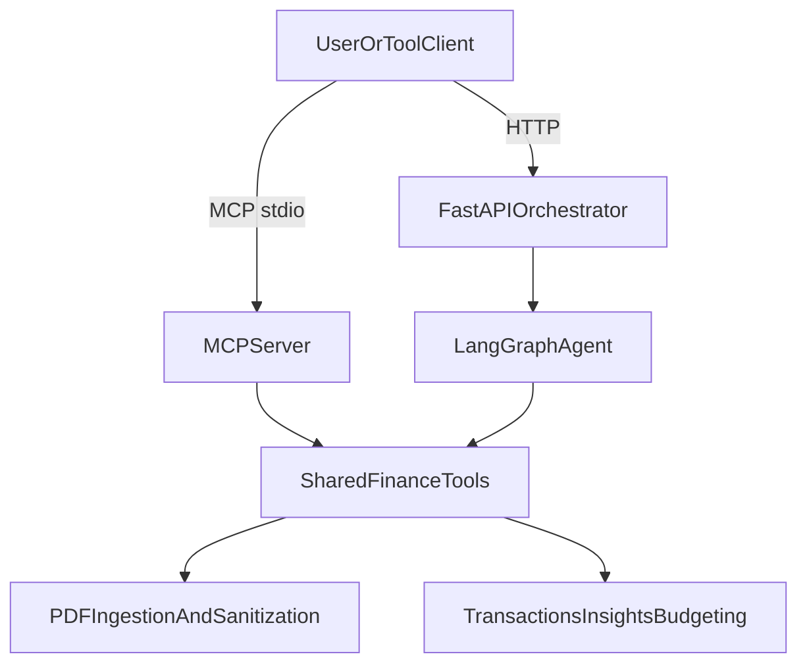

# Financial Data MCP Platform


Privacy-first financial intelligence platform with:
- MCP tool server
- Python orchestration API (single attachment-aware chat flow via LangGraph)
- Separate Next.js web app

You can use this repository in two ways:
- As an `MCP` server that exposes finance tools directly to MCP-compatible clients.
- As a `LangGraph`-powered agent that ingests PDF statements and answers natural-language questions through the API and UI.

## Architecture

```mermaid
flowchart LR
  user[UserBrowser] --> ui[NextJsUI]
  ui --> api[PythonOrchestratorAPI]
  api --> graph[LangGraphAgent]
  graph --> tools[FinanceTooling]
  tools --> ingest[PDFIngestionAndSanitization]
  tools --> analytics[SummaryAnomalyInsights]
  mcp[MCPServerStdio] --> tools
```

## Why this project exists

Financial statements are hard to use with AI safely. This project turns PDFs into sanitized transactions and lets users ask practical budget questions without persisting raw PII.

The important design choice is that both runtime modes share the same core financial tooling and privacy-first ingestion pipeline. That means you can either:
- call tools directly through MCP, or
- use the higher-level agent experience that selects tools and drafts answers for you.

## Features

- Privacy-first PDF ingestion (`ingest_financial_documents`)
- Session-scoped in-memory transaction state (no cross-user mixing)
- Composite insights tool (`financial_insights`)
- Budget planner capability for savings targets and max-savings estimation (`plan_savings`)
- Unified attachment-aware chat API for frontend apps
- Currency, crypto, and stock tools
- Shared tool layer used by both the MCP server and the LangGraph agent

## Runtime Modes

### 1. MCP Server

Use the MCP server when you want another AI client or MCP-compatible tool host to call finance tools directly.

This mode is best for:
- direct tool calling
- tool composition outside this repo
- IDE or desktop assistant integrations that speak MCP

### 2. LangGraph Agent

Use the LangGraph agent when you want a ready-to-use conversational workflow that:
- accepts PDF uploads
- ingests files ephemerally
- decides which transaction tools to call
- drafts a readable answer from tool outputs

This mode is best for:
- chat-style financial analysis
- PDF-first user workflows
- browser-based demos or productized Q&A experiences

## Core Tools

1. `ingest_financial_documents`
2. `list_transactions`
3. `get_spending_summary`
4. `flag_anomalies`
5. `financial_insights`
6. `plan_savings`
7. `convert_currency`
8. `get_crypto_price`
9. `get_stock_quote`

## Budget Planning Capability

The deterministic budget planning tool (`plan_savings`) is available in the shared finance tool layer and is now exposed through MCP as well as used by the LangGraph agent.

- It analyzes ingested historical debit transactions by month and category.
- It estimates `max_savings_estimate` with category-specific cut ceilings.
- It evaluates savings target feasibility (`target_met`) when a target is provided.
- It returns category-level recommendations and assumptions in `supporting_data` for agent/API usage.

Sample prompts:
- "How can I save 300 this month?"
- "What is the max savings I can do this month?"
- "Plan savings aggressively for a 500 target."

Notes:
- It requires ingested transaction history first.
- In MCP mode, it uses the same default in-memory transaction session as the other transaction tools.

## Repository Layout

- `app/main.py` - MCP registration + FastAPI app bootstrap
- `app/api/orchestrator.py` - session + unified chat API routes
- `app/api/schemas.py` - response/request contracts
- `app/agent/` - LangGraph state, prompts, nodes, graph, and runner
- `app/tools/ingestion.py` - PDF extraction + sanitization
- `app/tools/transactions.py` - analytics over ingested session data
- `app/tools/insights.py` - composite summary + anomaly interpretation
- `ui/` - production Next.js web app
- `tests/` - backend unit/API tests

## Quickstart

### 1) Shared setup

```bash
python -m venv .venv
source .venv/bin/activate
pip install -e ".[test]"
pytest
```

### 2) Create a real local env file

`.env.example` is only a template. It is not loaded automatically by `uvicorn`, and values inside it do not become environment variables unless you explicitly load them.

Create a real local `.env` file first:

```bash
cp .env.example .env
```

Then edit `.env` and set your real Anthropic key:

```bash
ANTHROPIC_API_KEY=your-real-key
```

If you do not provide `ANTHROPIC_API_KEY`, the LangGraph agent still runs, but planning and answer composition fall back to deterministic logic instead of Anthropic responses.

### 3) Run the MCP server

This runs the stdio MCP server for MCP-compatible clients:

```bash
python -m app.main
```

### 4) Run the LangGraph orchestration API

This runs the FastAPI app that powers the attachment-aware chat flow:

```bash
uvicorn app.main:app --reload
```

If you want `uvicorn` to load values from your local `.env` file automatically, run:

```bash
uvicorn app.main:app --env-file .env --reload
```

Or use:

```bash
make orchestrator-env
```

### 5) Run the frontend

```bash
cd ui
npm install
npm run dev
```

Frontend default URL: `http://localhost:3000`
Backend default URL: `http://localhost:8000`

## How The Two Parts Fit Together

The repo has two main runtime surfaces built on top of the same finance tool layer:



- The `MCP server` is the direct tool surface.
- The `LangGraph agent` is the higher-level orchestration layer.
- Both modes rely on the same ingestion, sanitization, and financial tool implementations.

## MCP Server Usage

The MCP server exposes the shared finance tools directly, including:
- `ingest_financial_documents`
- `list_transactions`
- `get_spending_summary`
- `flag_anomalies`
- `financial_insights`
- `plan_savings`
- `convert_currency`
- `get_crypto_price`
- `get_stock_quote`

Typical MCP flow:
1. Call `ingest_financial_documents` with one or more PDF file paths.
2. Call transaction tools such as `get_spending_summary`, `financial_insights`, or `plan_savings`.
3. Treat crypto, stock, and currency tools as lower-level market utilities.

## Orchestration API Endpoints

The `POST /api/chat` endpoint now uses a unified transaction-first LangGraph workflow:
- read question and attachment refs for the current turn
- ingest uploaded PDFs ephemerally inside the graph
- require transaction context before running analysis tools
- plan one or more transaction tools with Anthropic (with deterministic local fallback)
- execute tools iteratively
- compose a readable answer
- privacy-filter the final answer and supporting data

### `POST /api/session`
Create a new user session.

Response:

```json
{"session_id":"<uuid>"}
```

### `GET /api/session/{session_id}/status`
Inspect whether a session has ingested data.

### `POST /api/chat`

Request:

This endpoint accepts multipart form data:
- `session_id`
- `question` (optional)
- `files` (optional, one or more PDFs)

Behavior:
- If PDFs are uploaded without a question, the agent ingests them and returns `status: "needs_input"` with a follow-up prompt.
- If no transaction data exists yet, the agent returns `status: "needs_input"` and asks for statement PDFs.
- If transaction data exists, the agent can plan multiple tools in one turn.

Response:

```json
{
  "session_id":"<uuid>",
  "status":"done",
  "answer":"Total spending is 1234.56 USD. Top categories are rent: 900.0 USD, food: 200.0 USD.",
  "tool_calls":["get_spending_summary"],
  "supporting_data":{
    "get_spending_summary": {
      "total_spend": 1234.56,
      "totals_by_category": {
        "rent": 900.0,
        "food": 200.0
      }
    }
  },
  "warnings":[],
  "missing_input": null
}
```

`status` values:
- `done` - the turn completed with an answer
- `needs_input` - the agent needs PDFs or a follow-up question
- `error` - the request failed internally

Budget-planning questions return the same response schema and include planner output under:
- `tool_calls`: contains `plan_savings`
- `supporting_data.plan_savings`: deterministic planning payload (estimate, recommendations, warnings)

## Privacy Guarantees

- Raw PDF text is processed ephemerally and never persisted.
- Only sanitized fields are retained: date, amount, merchant, category, currency, direction.
- Sanitization removes long numeric strings, emails, and address-like patterns.
- Logs avoid raw document content.
- Uploaded files are deleted after each `/api/chat` request finishes.

## Error Contract

```json
{
  "ok": false,
  "error": "No ingested transactions available. Upload PDFs first.",
  "source": "orchestrator"
}
```

## Environment Variables

- `FRONTEND_ORIGINS` (backend CORS, comma-separated)
- `ANTHROPIC_API_KEY` (optional, enables Anthropic-powered planning/composition; deterministic fallback still works without it)
- `LANGGRAPH_ANTHROPIC_MODEL` (optional model override; default `claude-3-5-sonnet-latest`)
- `LANGGRAPH_MAX_STEPS` (optional orchestration step cap; default `4`)
- `NEXT_PUBLIC_ORCHESTRATOR_URL` (frontend API base URL)

## Docker Compose (3 services)

```bash
docker compose up --build
```

Services:
- `orchestrator-api` on `:8000`
- `ui` on `:3000`
- `mcp-server` (stdio MCP process)